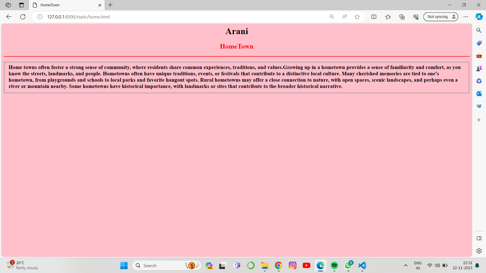
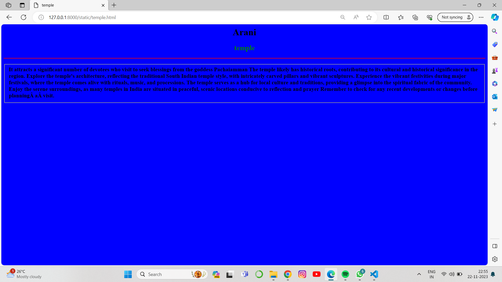
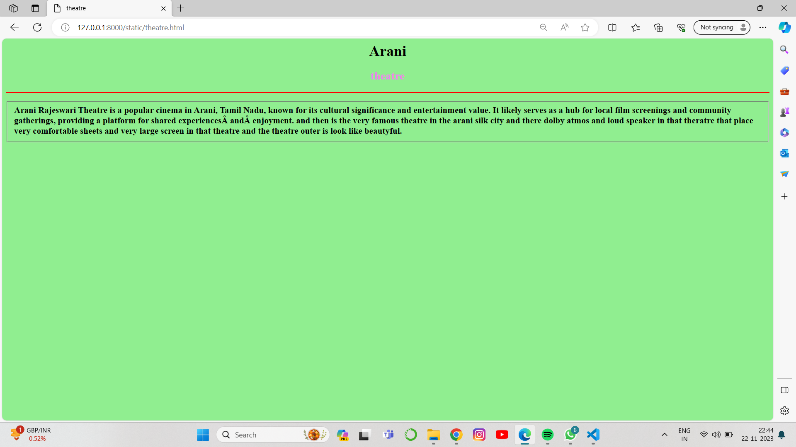
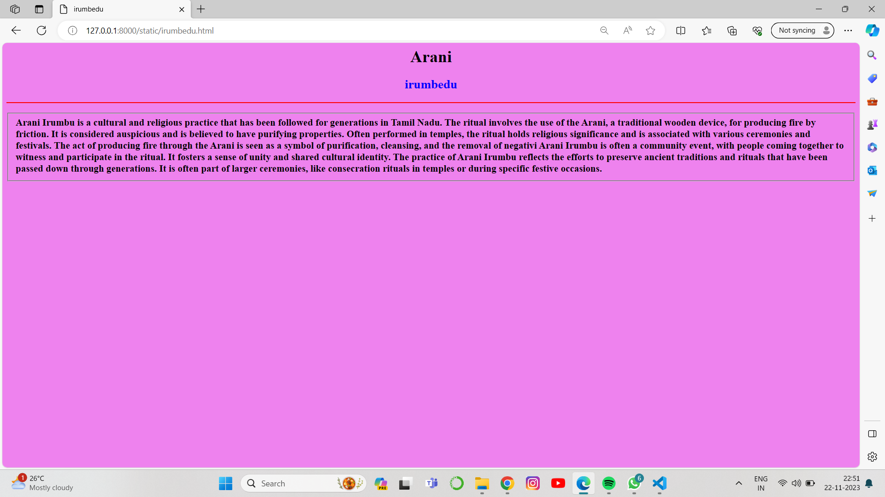
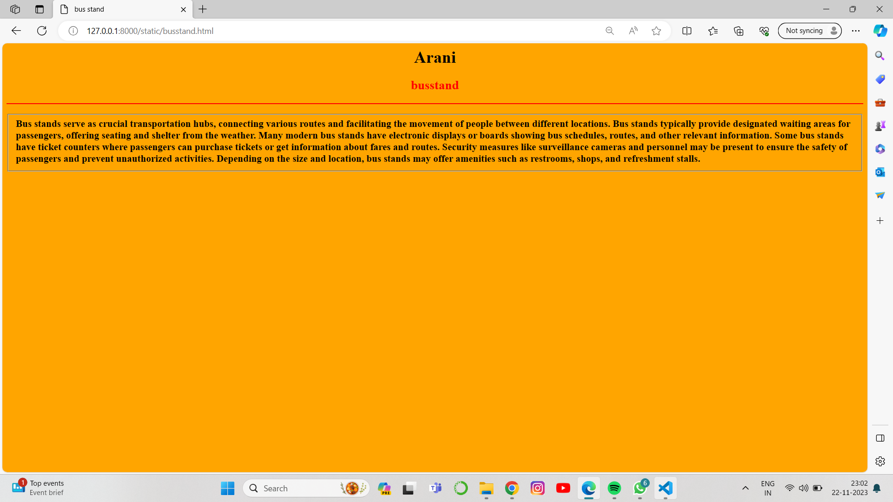

# Ex04 Places Around Me
## Date:22.11.2023

## AIM
To develop a website to display details about the places around my house.

## DESIGN STEPS

### STEP 1
Create a Django admin interface.

### STEP 2
Download your city map from Google.

### STEP 3
Using ```<map>``` tag name the map.

### STEP 4
Create clickable regions in the image using ```<area>``` tag.

### STEP 5
Write HTML programs for all the regions identified.

### STEP 6
Execute the programs and publish them.

## CODE
```
map.html

<html>
<head>
<title>My City</title>
</head>
<body>
<h1 align="center">
<font color="yellow"><b>Arani</b></font>
</h1>
<h3 align="center">
<font color="black"><b>RAMKUMAR G (23012546)</b></font>
</h3>
<center>

<map name="MyCity">
<area shape="rect" coords="720,300,800,350" href="home.html" title="My Home Town">
<area shape="rect" coords="1020,200,1100,300" href="temple.html" title="Shri Pachai Amman Temple">
<area shape="rect" coords="900,100,1000,200" href="irumbedu.html" title="irumbedu">
<area shape="rect" coords="800,300,1000,400" href="theatre.html" title="Rajeshwari theatre">
<area shape="rect" coords="800,25,1000,100" href="college.html" title="sri balaji chockalingam college">
<area shape="rect" coords="600,300,700,400" href="busstand.html" title="saithapet bus stop">
</map>
</center>
</body>
</html>

home.html

<html>
    <head><title>HomeTown</title></head>
    <style>
        *{background-color:pink;

        }
        h1{
            text-align: center;
            color:black;
        }
        h2{
            text-align: center;
            color: red;
        }
        
    </style>
    <body >
        <h1>Arani</h1>
        <h2>HomeTown</h2>
        <hr color="red">
        <h3><p> <fieldset>
            Home towns often foster a strong sense of community, where residents share common experiences, traditions, and values.Growing up in a hometown provides a sense of familiarity and comfort, as you know the streets, landmarks, and people.
             Hometowns often have unique traditions, events, or festivals that contribute to a distinctive local culture.
             Many cherished memories are tied to one's hometown, from playgrounds and schools to local parks and favorite hangout spots.
             Rural hometowns may offer a close connection to nature, with open spaces, scenic landscapes, and perhaps even a river or mountain nearby.
             Some hometowns have historical importance, with landmarks or sites that contribute to the broader historical narrative.
    <body>
</html>
 

 temple.html

 <html>
    <head><title>temple</title></head>
    <style>
        *{background-color:blue;

        }
        h1{
            text-align: center;
            color:black;
        }
        h2{
            text-align: center;
            color:green;
        }
        
    </style>
    <body >
        <h1>Arani</h1>
        <h2>temple</h2>
        <hr color="red">
        <h3><p> <fieldset>
            It attracts a significant number of devotees who visit to seek blessings from the goddess Pachaiamman
            The temple likely has historical roots, contributing to its cultural and historical significance in the region.
            Explore the temple's architecture, reflecting the traditional South Indian temple style, with intricately carved pillars and vibrant sculptures.
             Experience the vibrant festivities during major festivals, where the temple comes alive with rituals, music, and processions.
            The temple serves as a hub for local culture and traditions, providing a glimpse into the spiritual fabric of the community.
         Enjoy the serene surroundings, as many temples in India are situated in peaceful, scenic locations conducive to reflection and prayer
            Remember to check for any recent developments or changes before planning a visit.
            
    <body>
</html>

theatre.html

<html>
</html>
    <head><title>theatre</title></head>
    <style>
        *{background-color:lightgreen;

        }
        h1{
            text-align: center;
            color:black;
        }
        h2{
            text-align: center;
            color:violet;
        }
        
    </style>
    <body >
        <h1>Arani</h1>
        <h2>theatre</h2>
        <hr color="red">
        <h3><p> <fieldset>
            Arani Rajeswari Theatre is a popular cinema in Arani, Tamil Nadu, known for its cultural significance and entertainment value.
             It likely serves as a hub for local film screenings and community gatherings, providing a platform for shared experiences and enjoyment.
             and then is the very famous theatre in the arani silk city and there dolby atmos and loud speaker in that theratre that place very comfortable 
             sheets and very large screen in that theatre and the theatre outer is look like beautyful.

    <body>
</html>

irumbedu.html

<html>
    <head><title>irumbedu</title></head>
    <style>
        *{background-color:violet;

        }
        h1{
            text-align: center;
            color:black;
        }
        h2{
            text-align: center;
            color:blue;
        }
        
    </style>
    <body >
        <h1>Arani</h1>
        <h2>irumbedu</h2>
        <hr color="red">
        <h3><p> <fieldset>
            Arani Irumbu is a cultural and religious practice that has been followed for generations in Tamil Nadu.
             The ritual involves the use of the Arani, a traditional wooden device, for producing fire by friction. It is considered auspicious and is believed to have purifying properties.
 Often performed in temples, the ritual holds religious significance and is associated with various ceremonies and festivals.
The act of producing fire through the Arani is seen as a symbol of purification, cleansing, and the removal of negativi
 Arani Irumbu is often a community event, with people coming together to witness and participate in the ritual. It fosters a sense of unity and shared cultural identity.
 The practice of Arani Irumbu reflects the efforts to preserve ancient traditions and rituals that have been passed down through generations.
 It is often part of larger ceremonies, like consecration rituals in temples or during specific festive occasions.
    <body>
</html>
 

 busstand.html

 <html>
</html>
    <head><title>bus stand</title></head>
    <style>
        *{background-color:orange;

        }
        h1{
            text-align: center;
            color:black;
        }
        h2{
            text-align: center;
            color:red;
        }
        
    </style>
    <body >
        <h1>Arani</h1>
        <h2>busstand</h2>
        <hr color="red">
        <h3><p> <fieldset>
            Bus stands serve as crucial transportation hubs, connecting various routes and facilitating the movement of people between different locations.
        Bus stands typically provide designated waiting areas for passengers, offering seating and shelter from the weather.
Many modern bus stands have electronic displays or boards showing bus schedules, routes, and other relevant information.
 Some bus stands have ticket counters where passengers can purchase tickets or get information about fares and routes.
 Security measures like surveillance cameras and personnel may be present to ensure the safety of passengers and prevent unauthorized activities.
Depending on the size and location, bus stands may offer amenities such as restrooms, shops, and refreshment stalls.

    <body>
</html>


```

## OUTPUT
.png>)






## RESULT
The program for implementing image maps using HTML is executed successfully.
